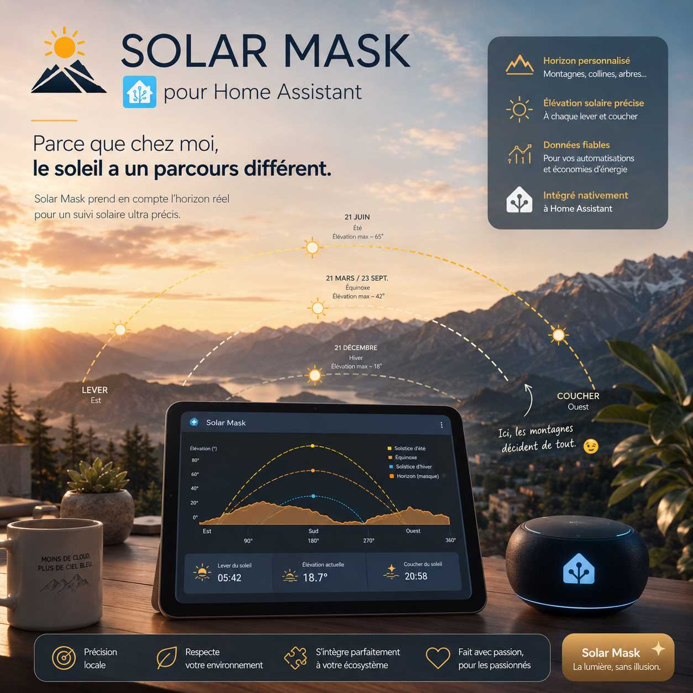

[](https://github.com/38decibel/Solar-Mask)
[](https://github.com/hacs/integration) [](https://github.com/38decibel/Solar-Mask)

# 🌞 Solar Mask — Home Assistant custom integration

**Solar Mask** is a Home Assistant custom integration that computes the **real sun visibility** for any location on your property, taking into account the surrounding obstacles (buildings, trees, hills) defined by a horizon mask file.

Unlike cloud-based solar forecasting services, Solar Mask works **entirely offline** using pure astronomical calculations — no API key, no account, no network required.



## About

The sun's position in the sky is perfectly predictable. What varies from one spot to another is what's blocking it: a neighbour's rooftop at 9 AM, a treeline in the afternoon, a hillside in winter.

Solar Mask lets you define that horizon — using a tool like **Azimutis** on your phone or the **PVGIS** web tool — and turns it into actionable Home Assistant entities. You can then use those entities to automate anything that depends on whether a specific zone is actually in sunlight: a pool pump, garden irrigation, a solar water heater, shutter control, etc.

## Features

- 📐 **Geometric sun visibility** — compares the sun's real-time elevation to the horizon mask at each azimuth
- 📅 **Daily sunlit windows** — computes start time, end time and total duration for each day
- 🔄 **Fully offline** — pure Python astronomy, zero external dependencies
- 🗂️ **Multi-zone support** — configure as many zones as you need (pool, terrace, vegetable garden…)
- 📡 **6 entities per zone** — binary sensor + 5 sensors, ready to use in automations and dashboards
- 📁 **Standard mask formats** — CSV (Azimutis) and HOR (PVGIS / PVsyst) are both supported

## Entities

For each configured zone named `<zone>`, the integration creates:

| Entity | Type | Description |
|--------|------|-------------|
| `binary_sensor.<zone>_sunlit` | Binary sensor | `ON` = sun currently visible, `OFF` = in shadow |
| `sensor.<zone>_sun_effective_elevation` | Sensor (°) | Sun elevation minus mask at current azimuth — positive = visible |
| `sensor.<zone>_sun_start` | Sensor (timestamp) | Today's first sunlit moment |
| `sensor.<zone>_sun_end` | Sensor (timestamp) | Today's last sunlit moment |
| `sensor.<zone>_sun_duration` | Sensor (min) | Total sunlit minutes today |
| `sensor.<zone>_solar_diagram` | Sensor | JSON data for the Solar Mask Card dashboard visualization |

### Key attributes

`binary_sensor.<zone>_sunlit` and `sensor.<zone>_sun_effective_elevation` both expose:

```yaml
sun_azimuth: 187.3        # current sun azimuth in degrees (0=N, 90=E, 180=S, 270=W)
sun_elevation: 42.1       # real sun elevation in degrees
mask_elevation: 8.5       # horizon mask height at current azimuth
effective_elevation: 33.6 # sun_elevation − mask_elevation (>0 = visible)
```

`sensor.<zone>_sun_duration` exposes a `windows` attribute — the list of all sunlit intervals today:

```yaml
windows:
  - start: "06:55"
    end: "20:15"
```

## Installation

### Via HACS (recommended)

1. In HACS, go to **Integrations** → **Custom repositories**
2. Add `https://github.com/38decibel/Solar-Mask` with category **Integration**
3. Install **Solar Mask**
4. Restart Home Assistant

### Manual

1. Copy `custom_components/solar_mask/` into your HA `config/custom_components/` folder
2. Restart Home Assistant

## Configuration

Add the following to your `configuration.yaml`:

```yaml
solar_mask:
  - name: pool
    mask_file: /config/solar_masks/pool.csv

  - name: terrace
    mask_file: /config/solar_masks/terrace.csv
    latitude: 45.1856    # optional — defaults to HA location
    longitude: 5.7376    # optional — defaults to HA location
```

| Parameter | Required | Description |
|-----------|----------|-------------|
| `name` | ✅ | Zone identifier — used as entity name prefix |
| `mask_file` | ✅ | Absolute path to the horizon mask file |
| `latitude` | ❌ | Override latitude for this zone (defaults to HA location) |
| `longitude` | ❌ | Override longitude for this zone (defaults to HA location) |

Restart Home Assistant after any configuration change (but before make sur to had store the csv files)

## How to create a mask file

A mask file describes the horizon around your zone as a series of **(azimuth, elevation)** pairs. Azimuth is the compass direction (0° = North, 90° = East, 180° = South, 270° = West). Elevation is the angle in degrees above the horizontal plane.

### Method 1 — Azimutis (recommended, on-site measurement)

**Azimutis** is a mobile app (Android/iOS) that uses your phone's sensors to measure the horizon directly on the spot.

1. Install **Azimutis** from the Play Store or App Store
2. Stand at the location you want to measure (pool edge, terrace, etc.)
3. Slowly pan your phone around 360°, tapping to record horizon points wherever the skyline changes (building edge, treetop, hill)
4. Export the data as **CSV** — the file is ready to use directly with Solar Mask

> **Tip:** Take measurements on a clear day. Aim for at least one point every 10–15° for a smooth mask, and more points in areas with complex obstacles.

### Method 2 — PVGIS Horizon Tool (remote, from satellite data)

The European Commission's **PVGIS** tool provides a satellite-derived horizon profile for any location.

1. Go to [https://re.jrc.ec.europa.eu/pvg_tools/en/tools.html](https://re.jrc.ec.europa.eu/pvg_tools/en/tools.html)
2. Check "Calculated horizon"
3. Click **Csv** — this gives you a `.csv` file
4. Delete all unnecessary datas (keep only 'A' & 'H_hor' columns).

> **Note:** PVGIS horizon data reflects the far-field topography (hills, mountains) but does not include nearby obstacles like buildings or trees. It is a useful starting point but should be combined with on-site measurements for best accuracy.

### Mask file format

Solar Mask accepts two formats:

**CSV format (Azimutis, PVGIS):**
```csv
azimuth,elevation
0,3.5
30,5.2
60,12.0
90,18.5
...
350,3.1
```

**HOR format (PVsyst / PVGIS HOR export):**
```
# Horizon file
0   3.5
30  5.2
60  12.0
...
```

Lines beginning with `#` are treated as comments. Both space-separated and comma-separated formats are auto-detected.

## Examples

### Dashboard card

Pair Solar Mask with the associated custom card [Solar Mask Card](https://github.com/38decibel/Solar-Mask-Card) for a visual solar diagram showing the sun's path over your horizon mask directly in your Lovelace dashboard.

```yaml
type: custom:solar-mask-card
entity: sensor.pool_solar_diagram
sun_entity: sensor.pool_sun_effective_elevation
title: "Solar diagram — Pool"
height: 340
```

### Automation — Pool pump

Run the pool pump only when the pool is in direct sunlight and total daily sunshine exceeds 2 hours:

```yaml
automation:
  - alias: "Pool pump — start when sunny"
    trigger:
      - platform: state
        entity_id: binary_sensor.pool_sunlit
        to: "on"
    condition:
      - condition: numeric_state
        entity_id: sensor.pool_sun_duration
        above: 120
    action:
      - service: switch.turn_on
        target:
          entity_id: switch.pool_pump

  - alias: "Pool pump — stop when shaded"
    trigger:
      - platform: state
        entity_id: binary_sensor.pool_sunlit
        to: "off"
    action:
      - service: switch.turn_off
        target:
          entity_id: switch.pool_pump
```

### Automation — Garden irrigation scheduling

Water the garden only before the sun reaches the terrace (to reduce evaporation):

```yaml
automation:
  - alias: "Irrigation — stop before sun hits terrace"
    trigger:
      - platform: state
        entity_id: binary_sensor.terrace_sunlit
        to: "on"
    action:
      - service: switch.turn_off
        target:
          entity_id: switch.garden_irrigation
```

### Template sensor — human-readable sun start time

```yaml
template:
  - sensor:
      - name: "Pool sun start (time)"
        state: >
          
          
            {{ as_datetime(s) | as_local | strftime('%H:%M') }}
          
            --:--
          
        icon: mdi:weather-sunset-up
```

## How it works

Solar Mask uses a pure Python implementation of the **Spencer/Grena solar position algorithm** — the same family of algorithms used by professional PV simulation software. At each update (every 5 minutes by default):

1. The sun's **azimuth and elevation** are computed for the current UTC time and the zone's coordinates
2. The mask file is interpolated at the current azimuth to get the **horizon elevation** at that direction
3. **Effective elevation** = sun elevation − mask elevation. If positive, the zone is sunlit.

Daily windows (start, end, duration) are computed once per day at midnight by sampling the full 24-hour period in 5-minute steps — all in a background thread to comply with Home Assistant's async architecture.

## License

MIT License — see [LICENSE](LICENSE) for details.
